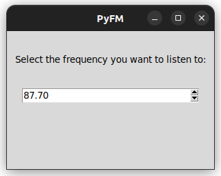

:construction:WORK IN PROGRESS:construction:

PyFM is a simple FM radio player coded in Python.

## Requirements:
- Linux
- Python
- A RTL-SDR dongle

## Installation
- Set up your RTL-SDR (installation instructions [here](https://pysdr.org/content/rtlsdr.html))
- Install [sounddevice](https://python-sounddevice.readthedocs.io/en)
- Install the Tkinter package (the exact package to install depends on your distribution)
- Install the requirements (`pip install -r requirements.txt` or `pipenv install -r requirements.txt`, if you use pipenv)

### Running the software
Simply run `python main.py`.

